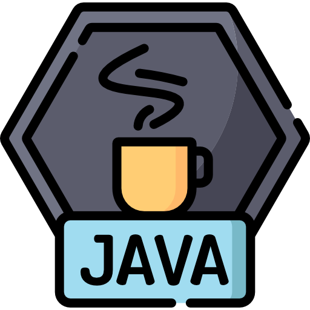

<h1 align="center"> Olá, eu sou Kauê Marques!</h1>

   <i>“There is a reason why all things are as they are.”</i> 
   <b>Bram Stoker, Dracula</b>
    
    
   

   
   
   

 

   

   
      
      Olá! Meu nome é Kauê. Sou <b>Engenheiro de Software</b> no Itaú Unibanco.
      
      
      Atuo no desenvolvimento de soluções escaláveis em sistemas financeiros e de mídia utilizando <b>Java (Spring), Go Lang e Python</b>, com forte foco em arquiteturas em <b>Nuvem AWS</b>. Possuo expertise em mensageria, bancos de dados NoSQL, Kubernetes e integração de Inteligência Artificial sistêmica.
   

   <h4><b>Principais Linguagens de Programação</b></h4>
   
   
   

  

   <h4><b>Principais Competências</b></h4>
   <ul>
      <li><b>Linguagens e Frameworks:</b> Java (Spring Boot), Go Lang, Python (Flask).</li>
      <li><b>Nuvem e Infraestrutura:</b> AWS (SQS, SNS, DynamoDB, ECS), Oracle Cloud (OCI), Google Cloud, Kubernetes, Docker.</li>
      <li><b>CI/CD e Ferramentas:</b> Jenkins, GitHub Actions, Jira, Shell Script.</li>
      <li><b>Arquitetura:</b> Princípios SOLID, Arquitetura Hexagonal e Data Mesh.</li>
   </ul>

 

   <h4><b>Experiência Profissional</b></h4>
   

      
<b>Itaú Unibanco - Software Engineer</b>

      <ul>
         <li>Colaboração com multinacionais no desenvolvimento de ferramentas para a implementação da solução PIX.</li>
         <li>Utilização de Java, Python e arquiteturas AWS em conformidade com as normas do Banco Central.</li>
         <li>Desenvolvimento de ferramentas proprietárias dentro do sistema MCP (Model Context Protocol) na plataforma de IA do banco.</li>
         <li>Construção de sistemas que utilizam análises automáticas e integração sistêmica de IA, incluindo o uso de modelos de linguagem personalizados (CLMs).</li>
      </ul>
   

   

      
<b>Banco Santander - Software Engineer</b>

      <ul>
         <li>Atuação em um projeto global para o banco espanhol focado no desenvolvimento e modernização de sistemas de pagamento de alta performance.</li>
         <li>Modernização de arquiteturas críticas de pagamentos utilizando a referência BIAN para garantir escalabilidade e resiliência das transações.</li>
      </ul>
   

   

      
<b>IBM - Java Software Developer</b>

      <ul>
         <li>Atuação em projeto para banco multinacional no desenvolvimento de sistemas de alto desempenho para processamento de PIX, boletos e cartões de crédito.</li>
         <li>Participação em migrações para a nuvem, visando escalabilidade, segurança e resiliência.</li>
         <li>Mentoria técnica e realização de onboardings técnicos focados nas melhores práticas da indústria.</li>
         <li>Aplicação de práticas de arquitetura como SOLID e Arquitetura Hexagonal.</li>
         <li>Integração de soluções de IA e dados utilizando IBM WatsonX AI e IBM Infosphere Data Architecture.</li>
      </ul>
   

   

      
<b>TV Globo - Java Software Engineer</b>

      <ul>
         <li>Identificação e resolução de falhas em sistemas legados e bancos de dados.</li>
         <li>Migração de sistemas legados para a nuvem (Google Cloud).</li>
         <li>Automação de processos manuais e rotinas de usuários para otimizar operações e transferências de arquivos.</li>
         <li>Utilização de Java, WebLogic, SpringBoot e OracleDB para gestão robusta de dados e aplicações.</li>
      </ul>
   

   

      
<b>Marques Kauê Classic Software - Software Engineer</b>

      <ul>
         <li>Liderança e gestão de projetos como consultor de software para diversos clientes.</li>
         <li>Desenvolvimento e manutenção de infraestrutura crítica em empresa de telecomunicações (ISP).</li>
         <li>Implementação de melhorias e otimizações em soluções de software ERP.</li>
         <li>Projeto de sistemas de armazenamento robustos e sistemas de gestão especializados.</li>
      </ul>
   

  

   <h4><b>Publicações em congressos</b></h4>
   <table>
      <tr align="center">
         <th>Congresso</th>
         <th>Titulo do trabalho</th>
         <th>aplicação pratica</th>
      </tr>
      <tr>
         <td>CONGRESSO DE INOVAÇÃO, CIÊNCIA E TECNOLOGIA DO IFSP</td>
         <td><a href="https://ocs.ifsp.edu.br/conict/xivconict/paper/view/9464" target="_blank">OTIMIZAÇÃO DA MANUTENÇÃO EM SISTEMAS LEGADOS: CASO DE ESTUDO DO ORACLE WEBLOGIC 11G</a>
</td>
         <td>Rapida identificação de erros em alguns servidores descentalizados de grande porte</td>
      </tr>
   </table>

   <h4><b>As certificações que obtive:</b></h4>
   <table>
      <tr align="center">
         <th>Badge</th>
         <th>Nome da Certificação</th>
         <th>Descrição Resumida</th>
      </tr>
      <tr>
         <td align="center"></td>
         <td>[1Z0-1085-21] Oracle Cloud Infrastructure Foundations Associate</td>
         <td>Discute os Serviços Core OCI e Serviços Nativos da Nuvem</td>
      </tr>
      <tr>
         <td align="center"></td>
         <td>Practitioner - D&amp;A Foundation</td>
         <td>Conhecimentos básicos sobre disciplinas relacionadas a dados, desde modelagem até análises avançadas.</td>
      </tr>
      <tr>
         <td align="center"></td>
         <td>Practitioner - Generative AI</td>
         <td>Conceitos fundamentais sobre Inteligência Artificial Generativa, no aspecto teórico e prático.</td>
      </tr>
      <tr>
         <td align="center"></td>
         <td>Gestão de Riscos - Trained</td>
         <td>Conceitos e comportamentos que inspiram positivamente no Gerenciamento dos Riscos.</td>
      </tr>
   </table>
    

<b>Tecnologias que domino:</b>

 

   

   
<b>Bancos de Dados</b>

   <ul>
      <li>MariaDB</li>
      <li>PostgreSQL</li>
      <li>Microsoft SQL Server</li>
      <li>Oracle Database</li>
      <li>DynamoDB (NoSQL)</li>
   </ul>
   

   

   
<b>Cloud</b>

   <ul>
      <li><b>AWS (Foco em Foundation e Developer):</b>
         <ul>
            <li><b>Computação:</b> EC2, Lambda, ECS, Fargate, Elastic Beanstalk</li>
            <li><b>Armazenamento:</b> S3, EBS, EFS</li>
            <li><b>Bancos de Dados:</b> DynamoDB, RDS, ElastiCache</li>
            <li><b>Redes e Entrega de Conteúdo:</b> VPC, Route 53, CloudFront, API Gateway</li>
            <li><b>Segurança e Identidade:</b> IAM, Cognito, KMS</li>
            <li><b>Integração e Mensageria:</b> SQS, SNS, EventBridge, Step Functions</li>
            <li><b>Monitoramento e Ferramentas de Desenvolvedor:</b> CloudWatch, CloudTrail, X-Ray, CodeBuild, CodeDeploy, CodePipeline</li>
         </ul>
      </li>
      <li>Google Cloud</li>
      <li>Oracle Cloud (OCI)</li>
   </ul>
   

   

   
<b>DevOps, Infraestrutura como Código (IaC) & Mensageria</b>

   <ul>
      <li>Apache Kafka</li>
      <li>Docker</li>
      <li>Kubernetes</li>
      <li>Terraform</li>
      <li>Rancher</li>
      <li>Shell Scripting</li>
      <li>GitHub Actions / Jenkins</li>
   </ul>
   

   

   
<b>Infraestrutura & IA</b>

   <ul>
      <li>WebLogic</li>
      <li>Payara Server</li>
      <li>GitLab</li>
      <li>Integração de Inteligência Artificial Sistêmica (LLMs, CLMs, IBM WatsonX AI, StackSpot AI, Google Gemini)</li>
   </ul>
   

   

   
<b>Frameworks</b>

   <ul>
      <li>Spring Boot</li>
      <li>Flask</li>
      <li>Jakarta EE / Java EE</li>
   </ul>
   

   

   
<b>ITSM / Metodologias Ágeis</b>

   <ul>
      <li>Jira</li>
      <li>Confluence</li>
      <li>ServiceNow</li>
      <li>Scrum</li>
   </ul>
   

