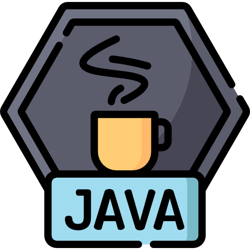

<h1 align="center"> Ola, eu sou Kaue Marques!</h1>

   <i>“There is a reason why all things are as they are.”</i> 
   <b>Bram Stoker, Dracula</b>
    
    
   

   
   
   

 

   

   
      
      Ola! Meu nome e Kaue. Sou <b>Engenheiro de Software</b> no Itau Unibanco.
       
      
      Atuo no desenvolvimento de solucoes escalaveis em sistemas financeiros e de midia utilizando <b>Java (Spring), Go Lang e Python</b>, com forte foco em arquiteturas em <b>Nuvem AWS</b>. Possuo expertise em mensageria, bancos de dados NoSQL, Kubernetes e integracao de Inteligencia Artificial sistemica.
   

   <h4><b>Principais Linguagens de Programacao</b></h4>
   
   
   

  

   <h4><b>Principais Competencias</b></h4>
   <ul>
      <li><b>Linguagens e Frameworks:</b> Java (Spring Boot), Go Lang, Python (Flask).</li>
      <li><b>Nuvem e Infraestrutura:</b> AWS (SQS, SNS, DynamoDB, ECS), Oracle Cloud (OCI), Google Cloud, Kubernetes, Docker.</li>
      <li><b>CI/CD e Ferramentas:</b> Jenkins, GitHub Actions, Jira, Shell Script.</li>
      <li><b>Arquitetura:</b> Principios SOLID, Arquitetura Hexagonal e Data Mesh.</li>
      <li><b>Idiomas:</b> Ingles Fluente (experiencia pratica conduzindo e lidando com demandas de comunicacao em projetos globais).</li>
   </ul>

 

   <h4><b>Experiencia Profissional</b></h4>
   

      
<b>Itau Unibanco - Software Engineer</b>

      <ul>
         <li>Colaboracao com multinacionais no desenvolvimento de ferramentas para a implementacao da solucao PIX.</li>
         <li>Utilizacao de Java, Python e arquiteturas AWS em conformidade com as normas do Banco Central.</li>
         <li>Desenvolvimento de ferramentas proprietarias dentro do sistema MCP (Model Context Protocol) na plataforma de IA do banco.</li>
         <li>Construcao de sistemas que utilizam analises automaticas e integracao sistemica de IA, incluindo o uso de modelos de linguagem personalizados (CLMs).</li>
      </ul>
   

   

      
<b>Banco Santander - Software Engineer</b>

      <ul>
         <li>Atuacao em um projeto global para o banco espanhol focado no desenvolvimento e modernizacao de sistemas de pagamento de alta performance.</li>
         <li>Modernizacao de arquiteturas criticas de pagamentos utilizando a referencia BIAN para garantir escalabilidade e resiliencia das transacoes.</li>
      </ul>
   

   

      
<b>IBM - Java Software Developer</b>

      <ul>
         <li>Atuacao em projeto para banco multinacional no desenvolvimento de sistemas de alto desempenho para processamento de PIX, boletos e cartoes de credito.</li>
         <li>Participacao em migracoes para a nuvem, visando escalabilidade, seguranca e resiliencia.</li>
         <li>Mentoria tecnica e realizacao de onboardings tecnicos focados nas melhores praticas da industria.</li>
         <li>Aplicacao de praticas de arquitetura como SOLID e Arquitetura Hexagonal.</li>
         <li>Integracao de solucoes de IA e dados utilizando IBM WatsonX AI e IBM Infosphere Data Architecture.</li>
      </ul>
   

   

      
<b>TV Globo - Java Software Engineer</b>

      <ul>
         <li>Identificacao e resolucao de falhas em sistemas legados e bancos de dados.</li>
         <li>Migracao de sistemas legados para a nuvem (Google Cloud).</li>
         <li>Automacao de processos manuais e rotinas de usuarios para otimizar operacoes e transferencias de arquivos.</li>
         <li>Utilizacao de Java, WebLogic, SpringBoot e OracleDB para gestao robusta de dados e aplicacoes.</li>
      </ul>
   

   

      
<b>Marques Kaue Classic Software - Software Engineer</b>

      <ul>
         <li>Lideranca e gestao de projetos como consultor de software para diversos clientes.</li>
         <li>Desenvolvimento e manutencao de infraestrutura critica em empresa de telecomunicacoes (ISP).</li>
         <li>Implementacao de melhorias e otimizacoes em solucoes de software ERP.</li>
         <li>Projeto de sistemas de armazenamento robustos e sistemas de gestao especializados.</li>
      </ul>
   

   

      
<b>Prefeitura Municipal - Setor de Tecnologia da Informacao</b>

      <ul>
         <li>Atuacao no suporte e manutencao da infraestrutura de tecnologia e sistemas governamentais.</li>
         <li>Apoio na digitalizacao de processos e atendimento tecnico as demandas do setor publico.</li>
      </ul>
   

 

   <h4><b>Publicacoes em congressos</b></h4>
   <table>
      <tr align="center">
         <th>Congresso</th>
         <th>Titulo do trabalho</th>
         <th>aplicacao pratica</th>
      </tr>
      <tr>
         <td>CONGRESSO DE INOVACAO, CIENCIA E TECNOLOGIA DO IFSP</td>
         <td><a href="https://ocs.ifsp.edu.br/conict/xivconict/paper/view/9464" target="_blank">OTIMIZACAO DA MANUTENCAO EM SISTEMAS LEGADOS: CASO DE ESTUDO DO ORACLE WEBLOGIC 11G</a>
</td>
         <td>Rapida identificacao de erros em alguns servidores descentralizados de grande porte</td>
      </tr>
   </table>

<!-- certs_start -->

   <h4><b>As certificacoes que obtive:</b></h4>
   <table>
      <tr align="center">
         <th>Badge</th>
         <th>Nome da Certificacao</th>
         <th>Descricao Resumida</th>
      </tr>
      <tr>
         <td align="center"></td>
         <td>Oracle Cloud Infrastructure Foundations 2021 Associate</td>
         <td>Certificacao baseada em implementacao de ecossistema na nuvem.</td>
      </tr>
      <tr><td align="center"></td><td>Camada Zero Foundation Trained - HubTech</td><td>Este badge certifica a capacitação técnica nos fundamentos do Camada Zero, validando o entendimento sobre arquitetura celular, princípios de engenharia e operação, além de conceitos introdutórios de multi-cloud, alinhados às práticas e desafios do programa.</td></tr>
      <tr><td align="center"></td><td>M365 Copilot - Expert</td><td>É capaz de explorar o potencial dos agentes prontos para uso da Microsoft como Analista, Pesquisador, Prompt Coach, entre outros. Desenvolve agentes funcionais no Agent Builder (Copilot Studio Lite) para resolver problemas no contexto empresarial, promovendo soluções de produtividade. Aplica o Copilot para atender necessidades reais e conhece funcionalidades adicionais da ferramenta.</td></tr>
      <tr><td align="center"></td><td>M365 Copilot - Trained</td><td>É capaz de iniciar atividades com o M365 Copilot, compreendendo suas principais funcionalidades e como utilizá-las de forma eficaz. Entende os conceitos introdutórios e é capaz de criar prompts eficientes e para se comunicar de forma eficaz com a IA generativa do M365 Copilot. Sabe aplicar as funcionalidades específicas do M365 Copilot em ferramentas como Teams, Outlook, Word, PowerPoint e Excel.</td></tr>
      <tr><td align="center"></td><td>Gestão de Riscos - Trained</td><td>Conhecer os conceitos e comportamentos de forma simples e direta que inspirem positivamente no Gerenciamento dos Riscos, além de promover o aculturamento que é de responsabilidade individual e coletiva. Entenda os princípios fundamentais das metodologias recomendadas institucionalmente e suas principais ferramentas.</td></tr>
      <tr><td align="center"></td><td>Practitioner - Generative AI</td><td>A pessoa que detém este Badge adquiriu os conceitos fundamentais sobre Inteligência Artificial Generativa, tanto no aspecto teórico quanto no prático. É capaz de entender os alicerces básicos da mecânica que sustenta as principais ferramentas de Inteligência Artificial Generativa, bem como compreender os seus potenciais casos de uso no âmbito social.</td></tr>
      <tr><td align="center"></td><td>Practitioner - D&A Foundation</td><td>A pessoa que detém esta Badge possui conhecimentos básicos sobre disciplinas relacionadas a dados, tendo sido introduzida aos conceitos e termos correntes em áreas como: Modelagem de Dados, Engenharia de Dados e Analytics, Ciência de Dados, Engenharia de Machine Learning e Governança de Dados. Sendo, portanto, letrada em dados, tendo intuição sobre o ciclo do dado, desde sua aquisição e tratamento até análises avançadas, entrega contínua e geração de valor.</td></tr>
   </table>
    

<!-- certs_end -->

<b>Tecnologias que domino:</b>

 

   

   
<b>Bancos de Dados</b>

   <ul>
      <li>MariaDB</li>
      <li>PostgreSQL</li>
      <li>Microsoft SQL Server</li>
      <li>Oracle Database</li>
      <li>DynamoDB (NoSQL)</li>
   </ul>
   

   

   
<b>Cloud</b>

   <ul>
      <li><b>AWS (Foco em Foundation e Developer):</b>
         <ul>
            <li><b>Computacao:</b> EC2, Lambda, ECS, Fargate, Elastic Beanstalk</li>
            <li><b>Armazenamento:</b> S3, EBS, EFS</li>
            <li><b>Bancos de Dados:</b> DynamoDB, RDS, ElastiCache</li>
            <li><b>Redes e Entrega de Conteudo:</b> VPC, Route 53, CloudFront, API Gateway</li>
            <li><b>Seguranca e Identidade:</b> IAM, Cognito, KMS</li>
            <li><b>Integracao e Mensageria:</b> SQS, SNS, EventBridge, Step Functions</li>
            <li><b>Monitoramento e Ferramentas de Desenvolvedor:</b> CloudWatch, CloudTrail, X Ray, CodeBuild, CodeDeploy, CodePipeline</li>
         </ul>
      </li>
      <li>Google Cloud</li>
      <li>Oracle Cloud (OCI)</li>
   </ul>
   

   

   
<b>DevOps, Infraestrutura como Codigo (IaC) & Mensageria</b>

   <ul>
      <li>Apache Kafka</li>
      <li>Docker</li>
      <li>Kubernetes</li>
      <li>Terraform</li>
      <li>Rancher</li>
      <li>Shell Scripting</li>
      <li>GitHub Actions / Jenkins</li>
   </ul>
   

   

   
<b>Infraestrutura & IA</b>

   <ul>
      <li>WebLogic</li>
      <li>Payara Server</li>
      <li>GitLab</li>
      <li>Integracao de Inteligencia Artificial Sistemica (LLMs, CLMs, IBM WatsonX AI, StackSpot AI, Google Gemini)</li>
   </ul>
   

   

   
<b>Frameworks</b>

   <ul>
      <li>Spring Boot</li>
      <li>Flask</li>
      <li>Jakarta EE / Java EE</li>
   </ul>
   

   

   
<b>ITSM / Metodologias Ageis</b>

   <ul>
      <li>Jira</li>
      <li>Confluence</li>
      <li>ServiceNow</li>
      <li>Scrum</li>
   </ul>
   

<!-- posts_start -->

   <h4><b>Ultimos posts no meu blog:</b></h4>
<ul>
      <li><a href="https://kauemarques.github.io/posts/postid-113/" target="_blank">Backrooms: review sem spoilers</a></li>
      <li><a href="https://kauemarques.github.io/posts/postid-110/" target="_blank">A Busca pelo Saber</a></li>
      <li><a href="https://kauemarques.github.io/posts/postid-98/" target="_blank">Entre Engrenagens e o Divino</a></li>
   </ul>

<!-- posts_end -->